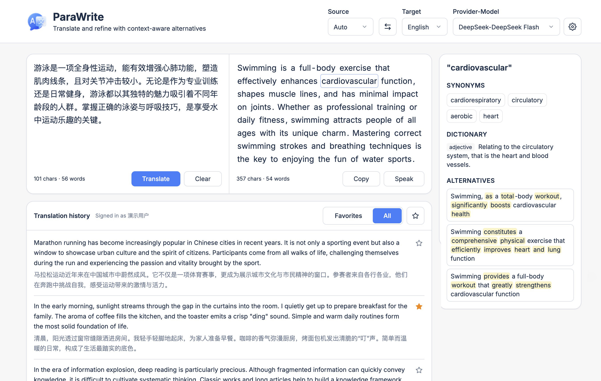
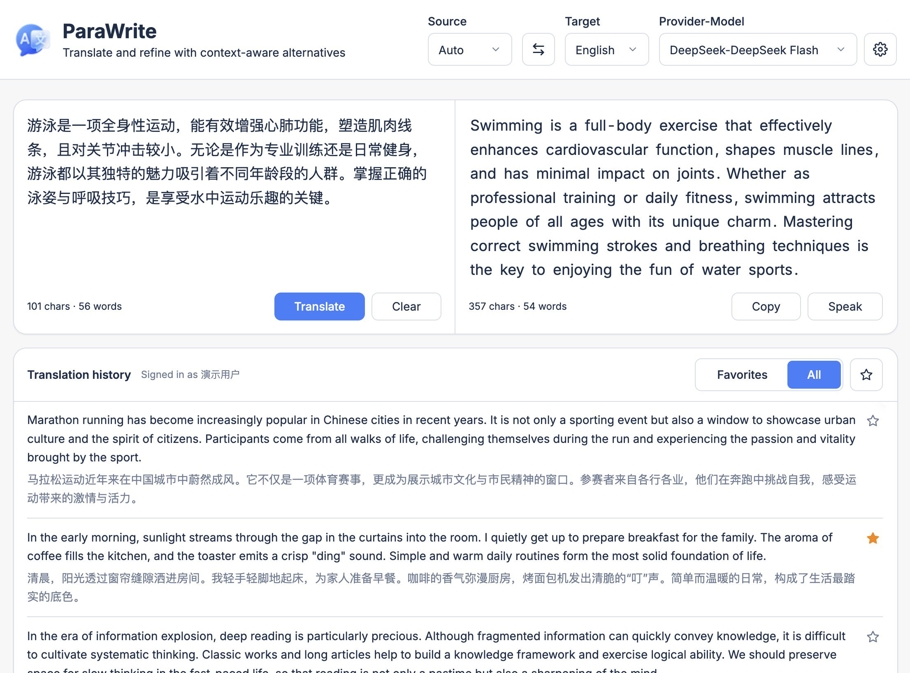
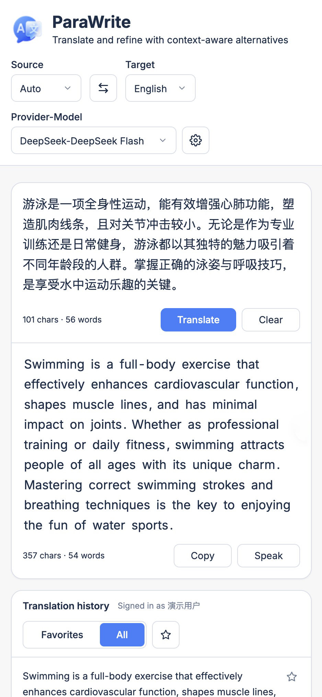
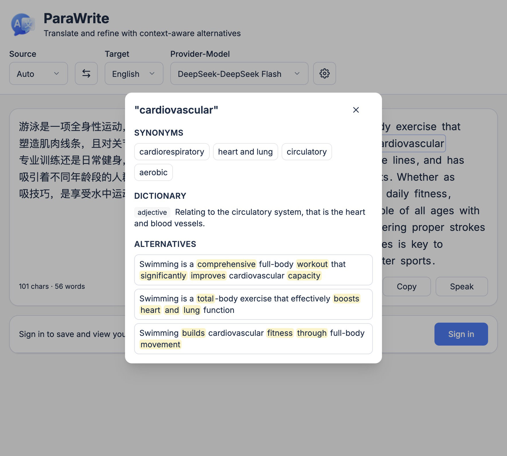
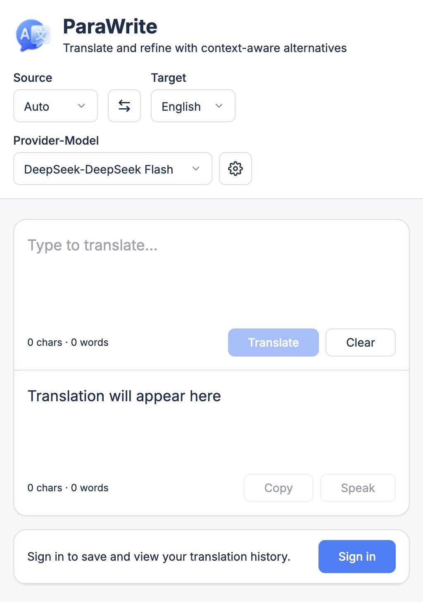

# ParaWrite

[English](README.md) | [中文](README.zh-CN.md)

ParaWrite is an open-source writing assistant inspired by DeepL's "Alternatives" feature. Translate text with streaming LLM output, then refine the result with context-aware synonyms, dictionary lookups, and sentence rephrasing.

**Version 0.6.2** — see [CHANGELOG.md](CHANGELOG.md) · [中文更新日志](CHANGELOG.zh-CN.md).

## Screenshots

| Desktop (three-column) | Tablet (two-column) |
|:---:|:---:|
|  |  |

| Mobile (stacked) | Synonyms & alternatives |
|:---:|:---:|
|  |  |

| Main interface | Login dialog |
|:---:|:---:|
|  |  |

More UI details: [docs/UI-DESIGN.md](docs/UI-DESIGN.md).

## Features

- **Streaming translation** with DeepL-style source/target panes and responsive layouts
- **Word panel** — synonyms, bilingual dictionary, and alternative phrasings on word click
- **Configurable LLM backends** — OpenAI-compatible APIs, Claude, and Ollama via YAML
- **PWA** — installable app with offline shell
- **Optional user accounts** — SQLite-backed translation history and favorites

## Prerequisites

- Node.js **≥ 22**
- pnpm **9.15** (see `packageManager` in `package.json`)

## Quick Start

```bash
pnpm install
cp config/parawrite.example.yaml config/parawrite.yaml
export OPENAI_API_KEY=your-key-here   # or set keys in parawrite.yaml
pnpm dev
```

- Frontend: http://localhost:5173 (proxies `/api` to the backend)
- Backend: http://localhost:8787

Production:

```bash
pnpm build
pnpm start    # serves API + built frontend on :8787
```

See [docs/DEPLOYMENT.md](docs/DEPLOYMENT.md) for Docker and beta packaging.

## Architecture

```
parawrite/
├── apps/web/       # Vite + React frontend (PWA)
├── apps/server/    # Hono API + static file server
├── packages/core/  # Shared engines, dictionary, config, types
├── config/         # YAML templates (secrets gitignored)
├── data/           # SQLite user data (gitignored)
├── docker/         # Production Docker
└── docs/           # Technical documentation
```

## Documentation

| Document | Description |
|----------|-------------|
| [docs/README.md](docs/README.md) | Documentation index |
| [docs/ARCHITECTURE.md](docs/ARCHITECTURE.md) | System design and request flow |
| [docs/CONFIGURATION.md](docs/CONFIGURATION.md) | YAML configuration reference |
| [docs/API.md](docs/API.md) | HTTP API and SSE protocol |
| [docs/DEPLOYMENT.md](docs/DEPLOYMENT.md) | Docker, beta package, environment variables |
| [docs/DEVELOPMENT.md](docs/DEVELOPMENT.md) | Local development and build scripts |
| [docs/UI-DESIGN.md](docs/UI-DESIGN.md) | UI tokens, layout, and screenshots |

## License

MIT — see [LICENSE](LICENSE).
